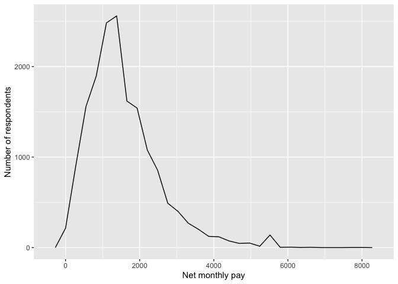
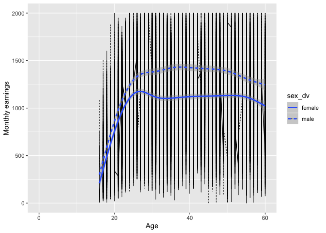
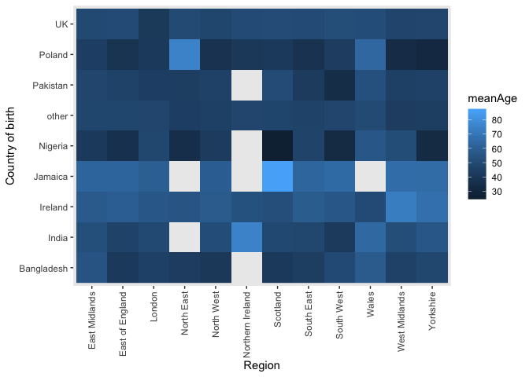

Statistical assignment 4
================
Youran Xu
March 2nd, 2020

In this assignment you will need to reproduce 5 ggplot graphs. I supply
graphs as images; you need to write the ggplot2 code to reproduce them
and knit and submit a Markdown document with the reproduced graphs (as
well as your .Rmd file).

First we will need to open and recode the data. I supply the code for
this; you only need to change the file paths.

    ```r
    library(tidyverse)
    Data8 <- read_tsv("/Users/youran/Data3-2020/data/UKDA-6614-tab/tab/ukhls_w8/h_indresp.tab")
    Data8 <- Data8 %>%
        select(pidp, h_age_dv, h_payn_dv, h_gor_dv)
    Stable <- read_tsv("/Users/youran/Data3-2020/data/UKDA-6614-tab/tab/ukhls_wx/xwavedat.tab")
    Stable <- Stable %>%
        select(pidp, sex_dv, ukborn, plbornc)
    Data <- Data8 %>% left_join(Stable, "pidp")
    rm(Data8, Stable)
    Data <- Data %>%
        mutate(sex_dv = ifelse(sex_dv == 1, "male",
                           ifelse(sex_dv == 2, "female", NA))) %>%
        mutate(h_payn_dv = ifelse(h_payn_dv < 0, NA, h_payn_dv)) %>%
        mutate(h_gor_dv = recode(h_gor_dv,
                         `-9` = NA_character_,
                         `1` = "North East",
                         `2` = "North West",
                         `3` = "Yorkshire",
                         `4` = "East Midlands",
                         `5` = "West Midlands",
                         `6` = "East of England",
                         `7` = "London",
                         `8` = "South East",
                         `9` = "South West",
                         `10` = "Wales",
                         `11` = "Scotland",
                         `12` = "Northern Ireland")) %>%
        mutate(placeBorn = case_when(
                ukborn  == -9 ~ NA_character_,
                ukborn < 5 ~ "UK",
                plbornc == 5 ~ "Ireland",
                plbornc == 18 ~ "India",
                plbornc == 19 ~ "Pakistan",
                plbornc == 20 ~ "Bangladesh",
                plbornc == 10 ~ "Poland",
                plbornc == 27 ~ "Jamaica",
                plbornc == 24 ~ "Nigeria",
                TRUE ~ "other")
        )
    ```

Reproduce the following graphs as close as you can. For each graph,
write two sentences (not more\!) describing its main message.

1.  Univariate distribution (20 points).
    
    ``` r
    Data %>% 
        ggplot(aes(x = h_payn_dv)) +
        geom_freqpoly() +
        xlab("Net monthly pay") +
        ylab("Number of respondents")
    ```
    
    <!-- -->
    
    ``` r
    # The major distribution of participants sits below the net monthly income of 3000, with a peak at around 1300. There is also a much smaller peak of around 200 participants at the net monthly income of 5500.
    ```

2.  Line chart (20 points). The lines show the non-parametric
    association between age and monthly earnings for men and women.
    
    ``` r
    Data %>% 
        filter(!is.na(sex_dv)) %>% 
        ggplot(aes(x = h_age_dv, y = h_payn_dv, linetype = sex_dv)) +
        geom_line() +
        geom_smooth() +
        xlab("Age") +
        ylab("Monthly earnings") +
        xlim(0,60) +
        ylim(0,2000)
    ```
    
    <!-- -->
    
    ``` r
    # Monthly earnings increase with age before the decrease at 43 for men, and the age of 48 for women. Men in general have a higher monthly earning than women, with the gap starting to widen u at the age of 25. 
    ```

3.  Faceted bar chart (20 points).
    
    ``` r
    Data %>% 
        filter(!is.na(sex_dv)) %>% 
        filter(!is.na(placeBorn)) %>% 
        group_by(sex_dv, placeBorn) %>%
        summarise(medianPay = median(h_payn_dv, na.rm = TRUE)) %>% 
        ggplot(aes(x = sex_dv, y = medianPay)) +
        geom_bar(stat = "identity") +
        facet_wrap(~ as.factor(placeBorn)) +
        xlab("Sex") +
        ylab("Median Monthly net pay")
    ```
    
    <!-- -->
    
    ``` r
    # The pay gap between sexes exists among all groups of different origins, with participants from Ireland the widest pay gap, and Bangladesh the narrowest. However, monthly net pay in general is the lowest for people from Bangladesh (below £1000), which shows the exiistance of a pay gap between different groups of origins, which could also be due to the typical skill-levels of immigrant workers.
    ```

4.  Heat map (20 points).
    
    ``` r
    Data %>% 
        filter(!is.na(h_age_dv) & !is.na(h_gor_dv) & !is.na(placeBorn)) %>% 
        group_by(h_gor_dv, placeBorn) %>% 
        summarise(meanAge = mean(h_age_dv)) %>% 
        ggplot(aes(x = h_gor_dv, y = placeBorn, fill = meanAge)) +
        geom_tile() +
        geom_raster() +
        theme(
            panel.grid.major = element_blank(),
            panel.grid.minor = element_blank()
      ) +
        xlab("Region") +
        ylab("Country of birth") +
        theme(axis.text.x = element_text(angle = 90, hjust = 1, vjust = .5))
    ```
    
    <!-- -->
    
    ``` r
    # The graph shows the age distribution among different groups of origin and their residence area. To note that people from Nigeria, Bangladesh and Poland are particularly young, regardless their residence, which may be due to the reason of immigration - seeking for work.
    ```

5.  Population pyramid (20 points).
    
    ``` r
    #     Data %>%
    #+         filter(!is.na(sex_dv)) %>%
    #+         group_by(h_age_dv, sex_dv) %>% 
    #+         ggplot(aes(x = h_age_dv, fill = sex_dv)) +
    #+         geom_bar(data = subset(Data, sex_dv == "male")) +
    #+         geom_bar(data = subset(Data, sex_dv == "female"), aes(y = ..count.. * (-1)))
    
    
    ggplot(data = Data,aes(x = h_age_dv, fill = sex_dv)) + 
        geom_bar(data = subset(Data, sex_dv == "female")) + 
        geom_bar(data = subset(Data, sex_dv =="male"),aes(y=..count..*(-1))) + 
        coord_flip() +
        ylab("n") +
        xlab("Age") +
        labs(fill = "Sex")
    ```
    
    <!-- -->
    
    ``` r
     # The graph shows a tendency of aging population, with the majority at the age between 37.5 and 70, and halved the number of young labour force between the age of 25 and 35. However, the distribution across sex is rather even.
    ```
